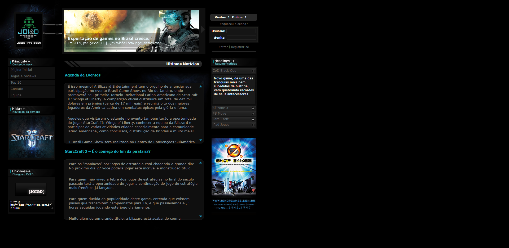
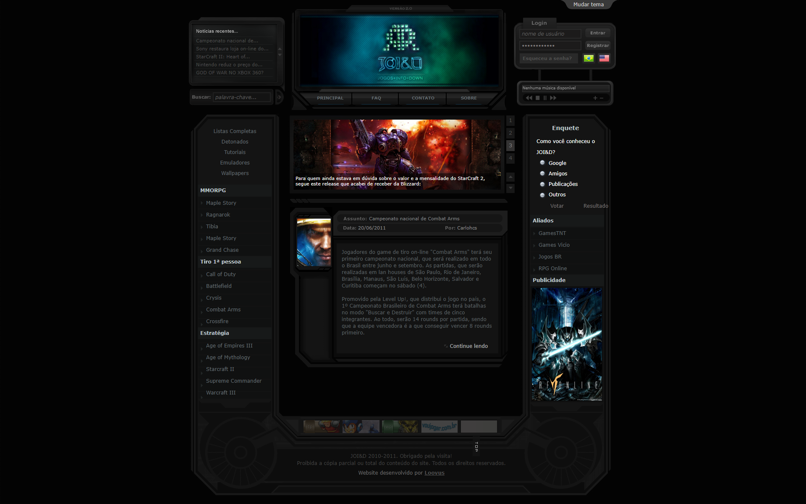
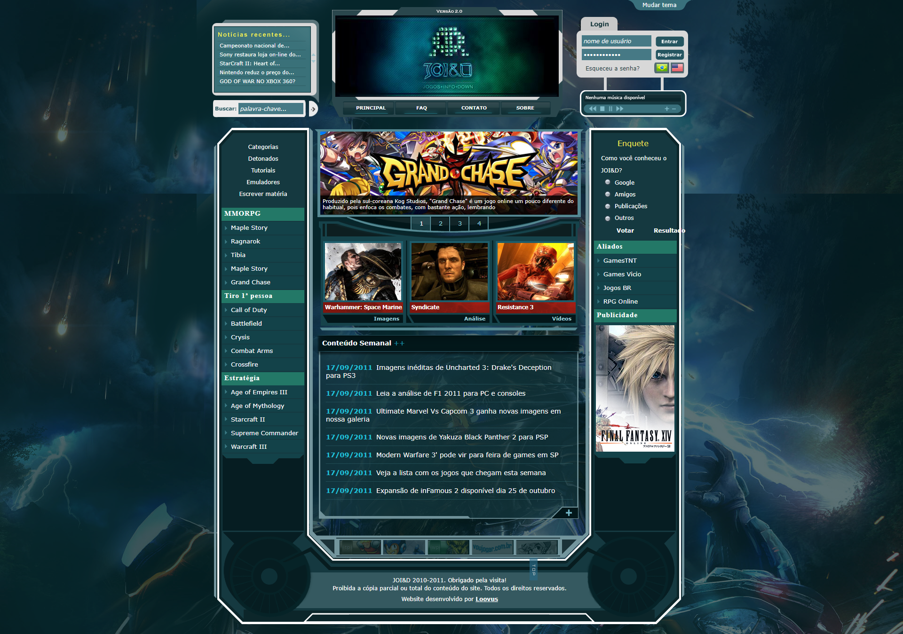
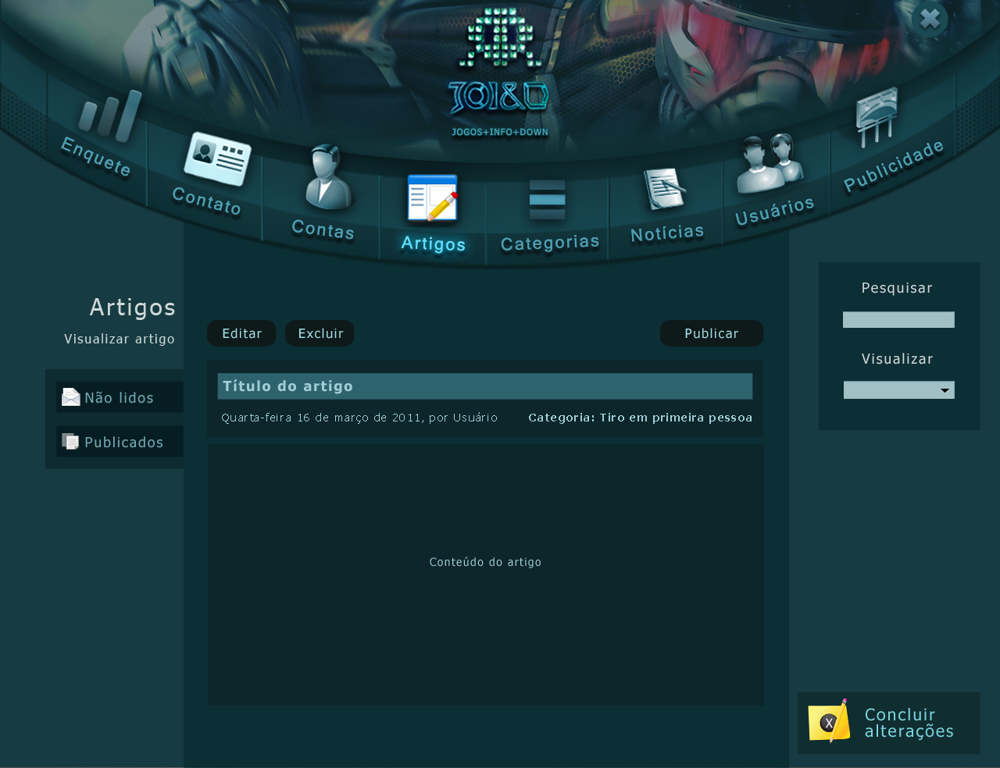
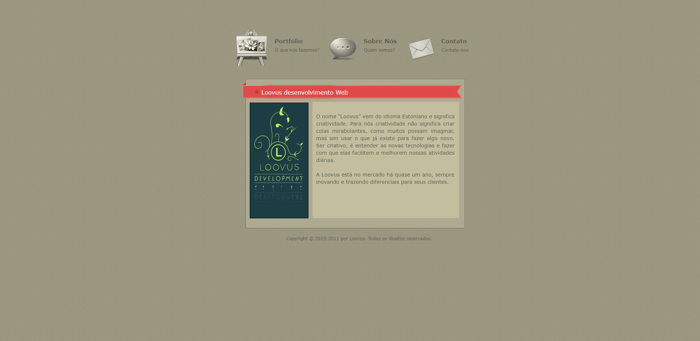

# Projetos de TCM e TCC - ETEC 2012

Este repositório contém os projetos de TCM (Trabalho de Conclusão de Módulo) e o TCC (Trabalho de Conclusão de Curso), apresentados aos professores na ETEC Parque da Juventude, no ano de 2012, para o curso de Informática para Internet.

## Do início até a entrega

O projeto de conclusão de curso era o objeto final de entrega obrigatório por todos os alunos. Eu tive a oportunidade de ficar em um grupo de 8 pessoas que se comprometeram com o projeto.

### JOI&D

Tendo em vista que precisaríamos criar um site que tivesse utilidade e pudesse ter integração com o ambiente desktop, criamos o nosso site então com o nome de **JOI&D**, que é um acrônimo para *Jogos, Informação e Download*. O site tinha como intuito, fornecer informações sobre jogos e também meios para baixá-los.

### LOOVUS

Afim de dar mais profissionalismo ao projeto, criamos a **LOOVUS** - que é uma palavra que vem do idioma estoniano e que significa *criatividade* -, a empresa fictícia por trás da *JOI&D*.

### Entregas

Ao final de cada trimestre, apresentávamos o *TCM*, para que os professores nos dessem orientações quanto ao mesmo, afim de alcançarmos o melhor projeto de *TCC*.

# Linha do tempo

## Primeira apresentação



**Características**

* Site estático: HTML/CSS e JavaScript (utilizando também jQuery)

## Segunda apresentação



**Características**

* Site estático com algumas funcionalidades dinâmicas: HTML/CSS, JavaScript (utilizando também jQuery) e PHP para o controle de enquetes e número de visitantes.

## Apresentação final

### Site



### Sistema desktop



**Características**

* Site dinâmico: todos os conteúdos agora eram servidos pelo PHP, em cima do Apache como servidor. Inicialmente o banco de dados era provido pelo MySQL, mas tendo em vista a necessidades maiores e melhor adaptação ao C# utilizado na aplicação desktop, foi migrado para o SQL Server;
* Algumas funcionalidades, como a visualização de mais notícias, era realizado através de AJAX, algo como novidade na épocaç
* No sistema desktop, era possível fazer todo o gerenciamento do site, onde era possível controlar itens como:
    * Enquetes;
    * Visualizar e responder os contatos dos usuários;
    * Administrar as contas de usuários;
    * Criar, editar e remover categorias de notícias;
    * Criar, editar e remover notícias;
    * Administrar as contas de administradores do sistema;
    * Alterar publicidades existentes no site;
    * Entre outros; 

### Site Loovus



# Códigos e documentações

## TCMs
- [Documentação](./TCMs/documentacao)
- [Código da primeira apresentação](./TCMs/TCM)
- [Código da segunda apresentação](./TCMs/TCM2)

## TCC
- [Documentação](./TCC/documentacao)
- [Código](./TCC/codigo)

# TODO

- Verificar problemas nos repositórios que possuem conteúdo dinâmico e corrigí-los;
- Hospedar todos os projetos e disponibilizar urls.

```Projeto entregue e aprovado em 2012.``` 